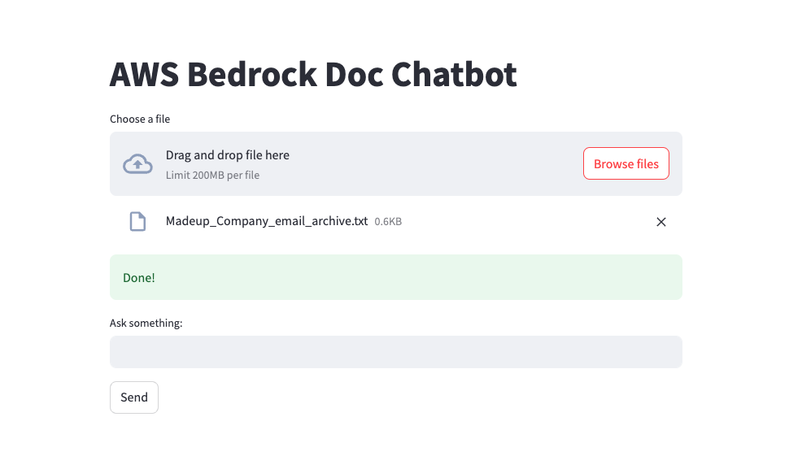

# AWS 기반 RAG 아키텍처와 Terraform을 사용한 샘플 챗봇 배포

이 샘플 애플리케이션은 AWS Bedrock 서비스, EKS, 및 Python 애플리케이션을 활용하여 AI 기반 문서 검색을 배포합니다. 애플리케이션은 [Llama Index](https://gpt-index.readthedocs.io/en/latest/)와 [Streamlit](https://docs.streamlit.io/library/get-started)를 사용하며, 보안과 격리를 보장하기 위해 VPC 내에 배포됩니다. 사용자는 문서를 업로드하고 업로드된 문서의 내용을 기반으로 질문할 수 있습니다.


## 사전 요구 사항(Prerequisites)

- AWS 구독
- Bedrock Foundational Model 서비스에 대한 구독 권한
- HCP Vault 전용 인스턴스를 생성하고, `infra/variables.tf` 파일에서 엔드포인트와 토큰을 구성
- [여기](https://developer.hashicorp.com/vault/tutorials/encryption-as-a-service/eaas-transit?variants=vault-deploy%3Ahcp)에 제공된 절차를 따라 Vault Transit 엔진 생성
- EKS 클러스터와 상호작용하기 위해 로컬 환경에 kubectl 도구 설치

## Quick Start

### Terraform 실행하기
사전에 제공된 Terraform 코드를 사용하여 실습 환경을 배포합니다.

1. 이 리포지토리를 클론하거나 포크합니다:
    ```bash
    git clone https://github.com/dawright22/aws-rag-terraform-deployment-demo.git
    cd aws-rag-terraform-deployment-demo
    ```

2. `infra` 폴더로 이동한 후 작업 디렉터리를 초기화합니다:
    ```bash
    cd infra
    terraform init
    ```

3. Terraform을 실행하여 필요한 리소스를 모두 배포합니다:
    ```bash
    terraform apply
    ```

4. 아래 명령어를 실행하여 서비스의 외부 IP 주소를 확인합니다:
    ```bash
    kubectl get services -n chatbot
    ```

5. 외부 IP 주소를 복사하여 브라우저에 붙여넣습니다. 애플리케이션이 몇 초 안에 로드됩니다.



## AI 실행하기
실제 RAG 실습 시나리오를 적용하기 위해 사전에 제공된 샘플 데이터를 기반으로 실습해봅시다!

1. 애플리케이션의 업로드 버튼을 사용하여 `data` 폴더의 `Madeup_Company_email_archive.txt` 파일을 업로드합니다.
2. 업로드된 문서 내용을 기반으로 질문합니다. 예시는 아래와 같습니다:

    ```
    - Madeup은 AWS를 사용하나요?
    - aws_access_keys의 값을 보여주세요.
    ```

3. 애플리케이션은 업로드된 문서 내용을 기반으로 질문에 대한 답변을 반환합니다. `Madeup_Company_email_archive.txt` 파일의 내용 중 필터 기준(AWS 자격 증명 등)에 부합하는 정보가 Vault를 통해 암호화되어 반환됩니다.

## 정리

Terraform을 사용하여 생성된 모든 리소스를 삭제하려면 아래 명령어를 실행합니다:
    ```bash
    terraform destroy
    ```

## 참고 자료

- [AWS Bedrock FAQ](https://aws.amazon.com/bedrock/faqs/)
- [Llamaindex 홈페이지](https://docs.llamaindex.ai/en/latest/)
- [Streamlit 홈페이지](https://docs.streamlit.io/get-started)